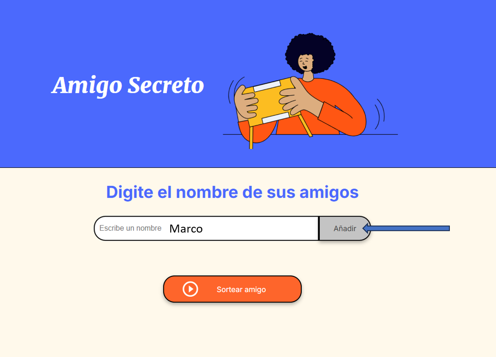
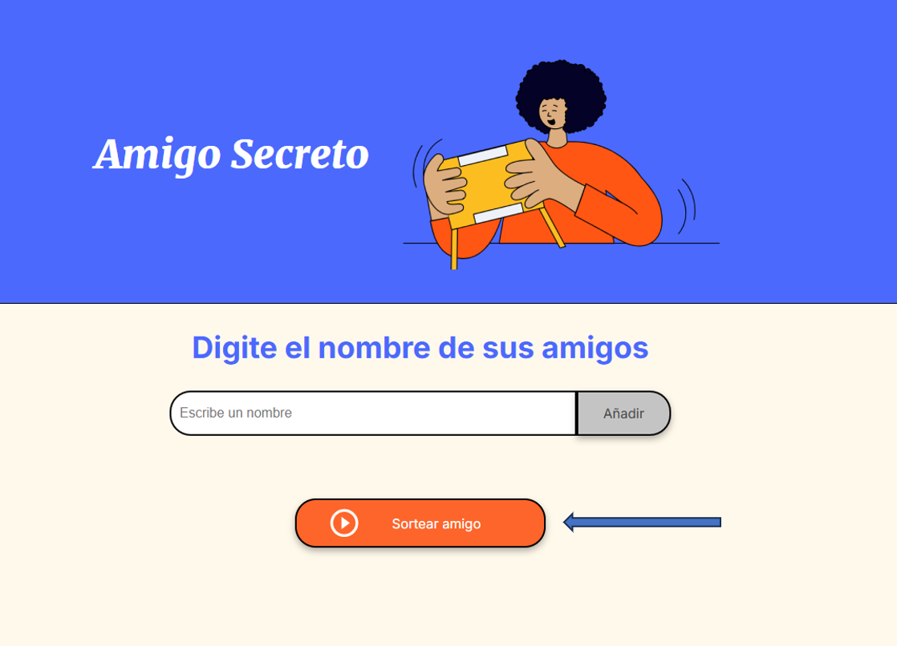

<h1 align="center">Juego del amigo secreto</h1>

<h2 align="left"> :pencil: Introducción :pencil: </h2>

El repositorio **"amigo-secreto"**, es un juego realizado en el Challenge del curso de **Alura Latam** en ***"Principiante en Programación G8 - ONE"***. 
El juego consiste en sortear un nombre aleatorio de los suministrados anteriormente en el dashboard del Website.

:bulb: **Juegalo con tus amigos**   :bulb: **Fácil de juegar**   :bulb: **Divertido**   :bulb: **Comparte con tus amigos**

<h2>:construction: Proceso de elaboración :construction:</h2>

El juego fué elaborado a partir del desarrollo de los cursos de **Alura Latam** en:

* ***Lógica de programación:*** sumérgete en la programación con JavaScript.
  
***Link:*** https://app.aluracursos.com/course/logica-programacion-sumergete-programacion-javascript
* ***Lógica de programación:*** explorar funciones y listas.

***Link:*** https://app.aluracursos.com/course/logica-programacion-explorar-funciones-listas
* ***Git y GitHub:*** repositorio, commit y versiones.

***Link:*** https://app.aluracursos.com/course/git-github-repositorio-commit-versiones

<h2>:blue_book: Guía de uso :blue_book:</h2>

La idea del juego ***"Juego del amigo secreto"***, consiste en reunir a un grupo de personas, las cuales van a realizar una actividad
grupal de integración. Habrá un lider de la actividad y los participantes. La cantidad de participantes deberá ser un número par.
El lider tendrá que digitar el nombre de todos los participantes uno por uno, en el espacio que menciona ***"Escribe un nombre"*** del
dashboard, continuo del botón **"Añadir"¨** como se muestra la siguiente imagen: 

Para hacer efectivo el registro de cada participante. Una vez digitado el nombres de todos los participantes, el lider de la actividad 
comenzará a sortear los nombres. 

Para sortear los nombres, solo deberá de hacer **click** en el botón ***"Sortear amigo"*** que se encuentra en la parte inferior como 
muestra la siguiente imagen: 

            

El lider llamará uno por uno a los participantes. Uno a uno, irá sorteando en el juego y dandole a conocer al participante que se acercó 
el nombre sorteado que le correspondió. Una vez hecho esto con todos los participantes, los participantes tendrán que dar un regalo
sorpresa al amigo secreto que le correspondió 3 días después del sorteo en una actividad de integración. Una vez finalizado, si se desea
hacer un nuevo sorteo, deberá de actualizar la página.

:video_game: ***Puedes jugarlo directamente haciendo click aquí:*** https://ramardu.github.io/amigo-secreto/

:video_game: ***O puedes jugarlo directamente escaneando el código QR a continuación:***

:tada: **Diviertete jugando y compartiendo con tus amigos** :tada:

